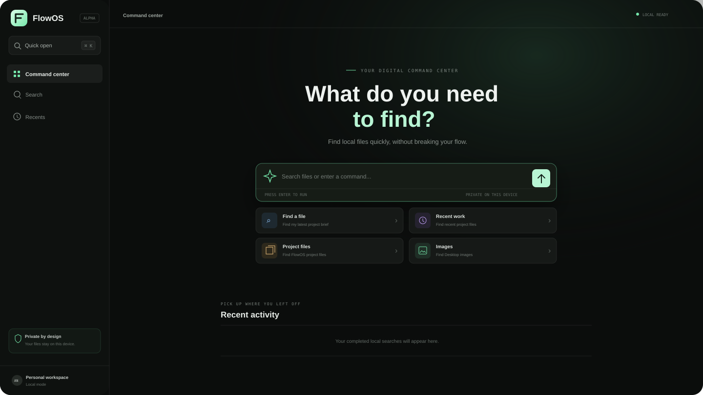

<div align="center">

# FlowOS

**A private command center for your computer.**

Find files, recover context, and move through your work from one fast desktop interface.

[](https://github.com/AlleyNawaz/FlowOS/actions/workflows/ci.yml)
[](LICENSE)
[](https://v2.tauri.app/)
[](#project-status)

</div>



FlowOS is a local-first desktop application built with Tauri, Rust, React, and TypeScript. It is designed to become the intelligent layer between people and their computers: fast enough for everyday use, useful without an account, and clear about what it can access.

## Available now

The current alpha provides a complete local file-discovery workflow:

- Native desktop builds for macOS, Windows, and Linux.
- A single command interface for natural-language file searches.
- Local search across Documents, Desktop, and Downloads.
- Ranked filename and path matching with recency-aware ordering.
- File opening and revealing through validated native commands.
- Configurable search locations and hidden-file visibility.
- Local search history with clear controls.
- Keyboard navigation and an in-application `Command/Ctrl + K` palette.
- Read-only search with no filename or file-content upload.
- Explicit errors when native functionality is unavailable.

FlowOS does not show simulated results or advertise unfinished modules as working features.

## Product direction

FlowOS is being developed as independently maintainable modules. The following capabilities are planned and are not part of the current alpha unless stated otherwise.

| Module | Capabilities |
|---|---|
| Desktop application | Global shortcut, menu-bar mode, instant invocation, accessible keyboard navigation, multi-monitor support, and native application launching. |
| Search engine | Incremental indexing, keyword search, full-text document search, OCR, local embeddings, semantic retrieval, and source-aware ranking. |
| AI engine | Streaming conversation, reasoning, document understanding, content creation, cited answers, task planning, local models, and opt-in remote providers. |
| Memory system | Preferences, history, projects, knowledge, and workflows with search, editing, export, expiry, and deletion. |
| Automation engine | Typed triggers and actions, workflow previews, explicit approval, durable execution, retries, cancellation, audit history, and rollback. |
| Plugin framework | Signed manifests, isolated execution, explicit permissions, version compatibility, installation, upgrades, disabling, and removal. |
| Integrations | Gmail, Google Drive, Dropbox, Slack, Notion, calendars, browsers, and other permission-aware sources. |
| Cloud services | Optional accounts, encrypted synchronization, billing, team policy, and shared connectors. Local search will continue to work offline. |
| Update system | Signed updates, stable and beta channels, staged rollout, integrity verification, and recovery. |
| Analytics | Consent-based activation, feature, crash, and performance measurements without collecting queries, filenames, paths, or document content. |
| Enterprise | Teams, roles, SSO, SCIM, audit export, retention controls, managed configuration, regional processing, and tenant isolation. |

## How it works

```text
React command interface
        │
        │ typed Tauri commands
        ▼
Rust permission boundary
        │
        ├── validates search scopes
        ├── scans local metadata in a worker
        ├── ranks matching files and folders
        └── validates every open or reveal request
```

The webview has no generic filesystem or shell permission. Native code accepts named search locations, canonicalizes file paths, rejects paths outside the supported roots, skips symlink recursion, and limits traversal depth and result volume.

The long-term architecture is a modular monolith with clear contracts between the desktop shell, local services, search, AI, memory, automation, plugins, updates, and analytics. This keeps local operations fast and avoids unnecessary service complexity.

## Project status

FlowOS is an early alpha for engineering and product validation. Local filename and path search works. Semantic search, document extraction, model-backed AI, memory, automation, plugins, automatic updates, and signed public releases remain under development.

Platform priorities:

1. macOS
2. Windows
3. Linux after the primary desktop experience is stable

The current macOS development build is ad-hoc signed. Public distribution requires Developer ID signing and notarization. Windows releases will require a trusted signing certificate.

## Development setup

Install:

- Node.js 22 or newer
- npm 11 or newer
- The stable Rust toolchain
- The [Tauri 2 prerequisites](https://v2.tauri.app/start/prerequisites/) for your platform

Then run:

```bash
git clone https://github.com/AlleyNawaz/FlowOS.git
cd FlowOS
npm ci
npm run tauri dev
```

For interface development without native file access:

```bash
npm run dev
```

The browser build never returns fabricated local results. It displays a clear error when a native-only action is requested.

## Build an installer

```bash
npm run tauri build
```

Tauri creates the installer for the current operating system under `src-tauri/target/release/bundle`.

Tagging a version such as `v0.2.0` starts the cross-platform release workflow. It builds draft macOS, Windows, and Linux installers so they can be signed, tested, and reviewed before publication.

## Quality checks

```bash
npm run check
npm run check:native
npm audit --audit-level=moderate
```

Every push to `main` runs:

- Version synchronization checks
- TypeScript compilation
- Frontend unit tests
- Production frontend build
- Dependency vulnerability checks
- Rust tests and Clippy on macOS, Windows, and Linux
- Pull-request dependency review

## Security and privacy

FlowOS follows a local-first trust model:

- Local search data stays on the device.
- No API keys or credentials are stored in the webview.
- Native capabilities are narrow and validated.
- Search is read-only.
- Future external or destructive actions must provide a preview and require explicit approval.
- Future memories must be visible, editable, exportable, and removable.
- Future plugins must run with isolated, declared permissions.

Please report vulnerabilities privately through [GitHub Security Advisories](https://github.com/AlleyNawaz/FlowOS/security/advisories/new). See [SECURITY.md](SECURITY.md) for the full policy.

## Documentation

- [Architecture review](docs/architecture-review.md) — current system, verified problems, target architecture, and delivery roadmap
- [Architecture](docs/ARCHITECTURE.md) — native boundaries, data model, and technical evolution
- [Product brief](docs/PRODUCT.md) — product position, user loop, and success measures
- [Roadmap](docs/ROADMAP.md) — milestone scope and exit criteria
- [Release process](docs/RELEASE.md) — versioning, signing, packaging, and release steps
- [Contributing guide](CONTRIBUTING.md) — development workflow and engineering standards
- [Changelog](CHANGELOG.md) — user-visible changes

## Contributing

FlowOS is under active development. Read [CONTRIBUTING.md](CONTRIBUTING.md) before opening a pull request. Changes should solve a demonstrated user problem, preserve the security boundary, include appropriate tests, and keep unfinished functionality out of the product interface.

## License

FlowOS is available under the [MIT License](LICENSE).
